# CHTTL 測試報告

## 1. 測試環境設定 (Environment Setup)

### 測試設備
- **Attacker**
  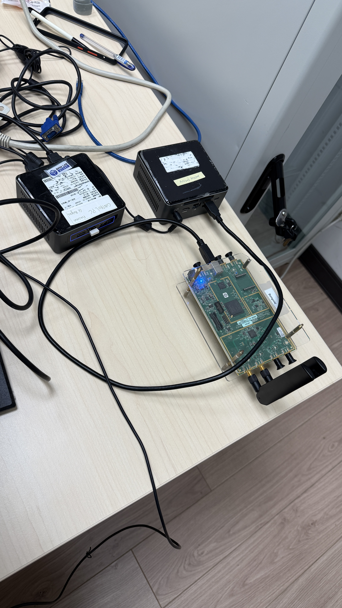
- **ELT**
  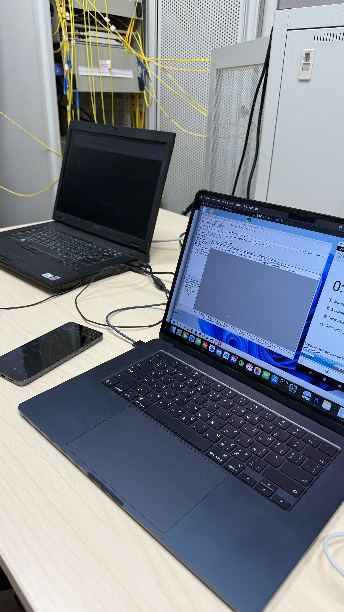
- **MTK UE**
  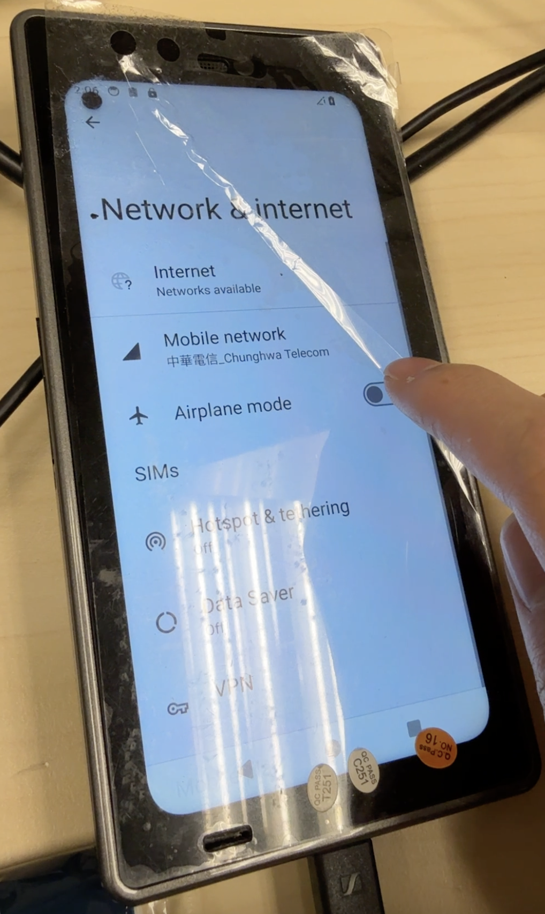
  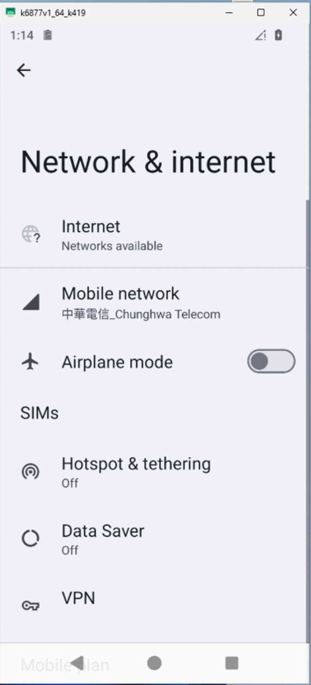
---

## 2. 參數設定與組態 (Configuration)

### 2.1 商用基站 (Commercial BBU)
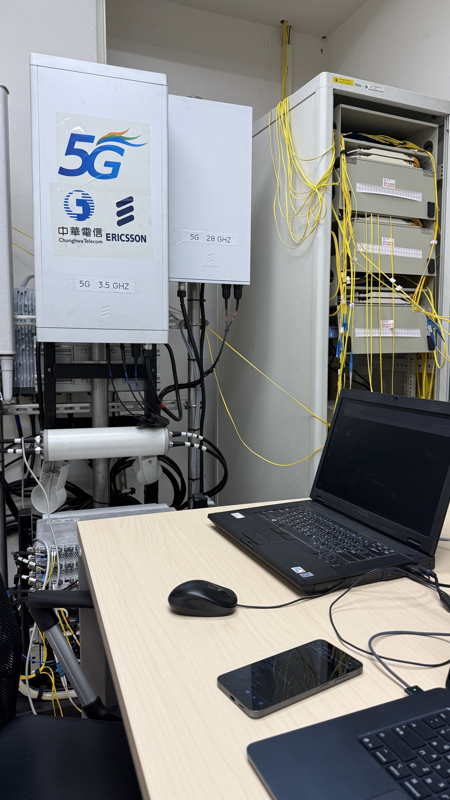

#### SIB1 訊息內容
```xml
<SIB1>
    <cellSelectionInfo>
        <q-RxLevMin>-40</q-RxLevMin>
    </cellSelectionInfo>
    <cellAccessRelatedInfo>
        <plmn-IdentityInfoList>
            <PLMN-IdentityInfo>
                <plmn-IdentityList>
                    <PLMN-Identity>
                        <mcc>
                            <MCC-MNC-Digit>4</MCC-MNC-Digit>
                            <MCC-MNC-Digit>6</MCC-MNC-Digit>
                            <MCC-MNC-Digit>6</MCC-MNC-Digit>
                        </mcc>
                        <mnc>
                            <MCC-MNC-Digit>1</MCC-MNC-Digit>
                            <MCC-MNC-Digit>1</MCC-MNC-Digit>
                        </mnc>
                    </PLMN-Identity>
                </plmn-IdentityList>
                <trackingAreaCode>
                    000000000000000000000001
                </trackingAreaCode>
                <cellIdentity>
                    000000000100111000100110000000001011
                </cellIdentity>
                <cellReservedForOperatorUse><notReserved/></cellReservedForOperatorUse>
            </PLMN-IdentityInfo>
        </plmn-IdentityInfoList>
    </cellAccessRelatedInfo>
    <servingCellConfigCommon>
        <downlinkConfigCommon>
            <frequencyInfoDL>
                <frequencyBandList>
                    <NR-MultiBandInfo>
                        <freqBandIndicatorNR>78</freqBandIndicatorNR>
                    </NR-MultiBandInfo>
                </frequencyBandList>
                <offsetToPointA>86</offsetToPointA>
                <scs-SpecificCarrierList>
                    <SCS-SpecificCarrier>
                        <offsetToCarrier>0</offsetToCarrier>
                        <subcarrierSpacing><kHz30/></subcarrierSpacing>
                        <carrierBandwidth>106</carrierBandwidth>
                    </SCS-SpecificCarrier>
                </scs-SpecificCarrierList>
            </frequencyInfoDL>
            <initialDownlinkBWP>
                <genericParameters>
                    <locationAndBandwidth>28875</locationAndBandwidth>
                    <subcarrierSpacing><kHz30/></subcarrierSpacing>
                </genericParameters>
                <pdcch-ConfigCommon>
                    <setup>
                        <commonSearchSpaceList>
                            <SearchSpace>
                                <searchSpaceId>1</searchSpaceId>
                                <controlResourceSetId>0</controlResourceSetId>
                                <monitoringSlotPeriodicityAndOffset>
                                    <sl1></sl1>
                                </monitoringSlotPeriodicityAndOffset>
                                <monitoringSymbolsWithinSlot>
                                    10000000000000
                                </monitoringSymbolsWithinSlot>
                                <nrofCandidates>
                                    <aggregationLevel1><n0/></aggregationLevel1>
                                    <aggregationLevel2><n0/></aggregationLevel2>
                                    <aggregationLevel4><n0/></aggregationLevel4>
                                    <aggregationLevel8><n1/></aggregationLevel8>
                                    <aggregationLevel16><n0/></aggregationLevel16>
                                </nrofCandidates>
                                <searchSpaceType>
                                    <common>
                                        <dci-Format0-0-AndFormat1-0>
                                        </dci-Format0-0-AndFormat1-0>
                                    </common>
                                </searchSpaceType>
                            </SearchSpace>
                        </commonSearchSpaceList>
                        <searchSpaceSIB1>0</searchSpaceSIB1>
                        <searchSpaceOtherSystemInformation>1</searchSpaceOtherSystemInformation>
                        <pagingSearchSpace>1</pagingSearchSpace>
                        <ra-SearchSpace>1</ra-SearchSpace>
                    </setup>
                </pdcch-ConfigCommon>
                <pdsch-ConfigCommon>
                    <setup>
                        <pdsch-TimeDomainAllocationList>
                            <PDSCH-TimeDomainResourceAllocation>
                                <k0>0</k0>
                                <mappingType><typeA/></mappingType>
                                <startSymbolAndLength>40</startSymbolAndLength>
                            </PDSCH-TimeDomainResourceAllocation>
                            <PDSCH-TimeDomainResourceAllocation>
                                <k0>0</k0>
                                <mappingType><typeA/></mappingType>
                                <startSymbolAndLength>96</startSymbolAndLength>
                            </PDSCH-TimeDomainResourceAllocation>
                            <PDSCH-TimeDomainResourceAllocation>
                                <k0>0</k0>
                                <mappingType><typeA/></mappingType>
                                <startSymbolAndLength>85</startSymbolAndLength>
                            </PDSCH-TimeDomainResourceAllocation>
                        </pdsch-TimeDomainAllocationList>
                    </setup>
                </pdsch-ConfigCommon>
            </initialDownlinkBWP>
            <bcch-Config>
                <modificationPeriodCoeff><n2/></modificationPeriodCoeff>
            </bcch-Config>
            <pcch-Config>
                <defaultPagingCycle><rf128/></defaultPagingCycle>
                <nAndPagingFrameOffset>
                    <oneT></oneT>
                </nAndPagingFrameOffset>
                <ns><one/></ns>
                <firstPDCCH-MonitoringOccasionOfPO>
                    <sCS30KHZoneT-SCS15KHZhalfT>
                        <INTEGER>1</INTEGER>
                    </sCS30KHZoneT-SCS15KHZhalfT>
                </firstPDCCH-MonitoringOccasionOfPO>
            </pcch-Config>
        </downlinkConfigCommon>
        <uplinkConfigCommon>
            <frequencyInfoUL>
                <scs-SpecificCarrierList>
                    <SCS-SpecificCarrier>
                        <offsetToCarrier>0</offsetToCarrier>
                        <subcarrierSpacing><kHz30/></subcarrierSpacing>
                        <carrierBandwidth>106</carrierBandwidth>
                    </SCS-SpecificCarrier>
                </scs-SpecificCarrierList>
                <p-Max>23</p-Max>
            </frequencyInfoUL>
            <initialUplinkBWP>
                <genericParameters>
                    <locationAndBandwidth>28875</locationAndBandwidth>
                    <subcarrierSpacing><kHz30/></subcarrierSpacing>
                </genericParameters>
                <rach-ConfigCommon>
                    <setup>
                        <rach-ConfigGeneric>
                            <prach-ConfigurationIndex>159</prach-ConfigurationIndex>
                            <msg1-FDM><one/></msg1-FDM>
                            <msg1-FrequencyStart>2</msg1-FrequencyStart>
                            <zeroCorrelationZoneConfig>14</zeroCorrelationZoneConfig>
                            <preambleReceivedTargetPower>-110</preambleReceivedTargetPower>
                            <preambleTransMax><n10/></preambleTransMax>
                            <powerRampingStep><dB4/></powerRampingStep>
                            <ra-ResponseWindow><sl10/></ra-ResponseWindow>
                        </rach-ConfigGeneric>
                        <totalNumberOfRA-Preambles>17</totalNumberOfRA-Preambles>
                        <ssb-perRACH-OccasionAndCB-PreamblesPerSSB>
                            <one><n16/></one>
                        </ssb-perRACH-OccasionAndCB-PreamblesPerSSB>
                        <ra-ContentionResolutionTimer><sf16/></ra-ContentionResolutionTimer>
                        <prach-RootSequenceIndex>
                            <l139>2</l139>
                        </prach-RootSequenceIndex>
                        <msg1-SubcarrierSpacing><kHz30/></msg1-SubcarrierSpacing>
                        <restrictedSetConfig><unrestrictedSet/></restrictedSetConfig>
                    </setup>
                </rach-ConfigCommon>
                <pusch-ConfigCommon>
                    <setup>
                        <groupHoppingEnabledTransformPrecoding><enabled/></groupHoppingEnabledTransformPrecoding>
                        <pusch-TimeDomainAllocationList>
                            <PUSCH-TimeDomainResourceAllocation>
                                <k2>1</k2>
                                <mappingType><typeA/></mappingType>
                                <startSymbolAndLength>27</startSymbolAndLength>
                            </PUSCH-TimeDomainResourceAllocation>
                            <PUSCH-TimeDomainResourceAllocation>
                                <k2>2</k2>
                                <mappingType><typeA/></mappingType>
                                <startSymbolAndLength>27</startSymbolAndLength>
                            </PUSCH-TimeDomainResourceAllocation>
                            <PUSCH-TimeDomainResourceAllocation>
                                <k2>3</k2>
                                <mappingType><typeA/></mappingType>
                                <startSymbolAndLength>27</startSymbolAndLength>
                            </PUSCH-TimeDomainResourceAllocation>
                            <PUSCH-TimeDomainResourceAllocation>
                                <k2>4</k2>
                                <mappingType><typeA/></mappingType>
                                <startSymbolAndLength>27</startSymbolAndLength>
                            </PUSCH-TimeDomainResourceAllocation>
                            <PUSCH-TimeDomainResourceAllocation>
                                <k2>5</k2>
                                <mappingType><typeA/></mappingType>
                                <startSymbolAndLength>27</startSymbolAndLength>
                            </PUSCH-TimeDomainResourceAllocation>
                            <PUSCH-TimeDomainResourceAllocation>
                                <k2>6</k2>
                                <mappingType><typeA/></mappingType>
                                <startSymbolAndLength>27</startSymbolAndLength>
                            </PUSCH-TimeDomainResourceAllocation>
                            <PUSCH-TimeDomainResourceAllocation>
                                <k2>7</k2>
                                <mappingType><typeA/></mappingType>
                                <startSymbolAndLength>27</startSymbolAndLength>
                            </PUSCH-TimeDomainResourceAllocation>
                            <PUSCH-TimeDomainResourceAllocation>
                                <k2>8</k2>
                                <mappingType><typeA/></mappingType>
                                <startSymbolAndLength>27</startSymbolAndLength>
                            </PUSCH-TimeDomainResourceAllocation>
                        </pusch-TimeDomainAllocationList>
                        <msg3-DeltaPreamble>6</msg3-DeltaPreamble>
                        <p0-NominalWithGrant>-100</p0-NominalWithGrant>
                    </setup>
                </pusch-ConfigCommon>
                <pucch-ConfigCommon>
                    <setup>
                        <pucch-ResourceCommon>12</pucch-ResourceCommon>
                        <pucch-GroupHopping><enable/></pucch-GroupHopping>
                        <hoppingId>611</hoppingId>
                        <p0-nominal>-114</p0-nominal>
                    </setup>
                </pucch-ConfigCommon>
            </initialUplinkBWP>
            <timeAlignmentTimerCommon><infinity/></timeAlignmentTimerCommon>
        </uplinkConfigCommon>
        <n-TimingAdvanceOffset><n25600/></n-TimingAdvanceOffset>
        <ssb-PositionsInBurst>
            <inOneGroup>
                10000000
            </inOneGroup>
        </ssb-PositionsInBurst>
        <ssb-PeriodicityServingCell><ms20/></ssb-PeriodicityServingCell>
        <tdd-UL-DL-ConfigurationCommon>
            <referenceSubcarrierSpacing><kHz30/></referenceSubcarrierSpacing>
            <pattern1>
                <dl-UL-TransmissionPeriodicity><ms2p5/></dl-UL-TransmissionPeriodicity>
                <nrofDownlinkSlots>3</nrofDownlinkSlots>
                <nrofDownlinkSymbols>10</nrofDownlinkSymbols>
                <nrofUplinkSlots>1</nrofUplinkSlots>
                <nrofUplinkSymbols>2</nrofUplinkSymbols>
            </pattern1>
            <pattern2>
                <dl-UL-TransmissionPeriodicity><ms2p5/></dl-UL-TransmissionPeriodicity>
                <nrofDownlinkSlots>2</nrofDownlinkSlots>
                <nrofDownlinkSymbols>10</nrofDownlinkSymbols>
                <nrofUplinkSlots>2</nrofUplinkSlots>
                <nrofUplinkSymbols>2</nrofUplinkSymbols>
            </pattern2>
        </tdd-UL-DL-ConfigurationCommon>
        <ss-PBCH-BlockPower>-1</ss-PBCH-BlockPower>
    </servingCellConfigCommon>
    <ue-TimersAndConstants>
        <t300><ms1000/></t300>
        <t301><ms400/></t301>
        <t310><ms2000/></t310>
        <n310><n20/></n310>
        <t311><ms3000/></t311>
        <n311><n1/></n311>
        <t319><ms400/></t319>
    </ue-TimersAndConstants>
</SIB1>
```

### 2.2 鎖定頻點 (Lock ARFCN)
```text
AT+EMMCHLCK=1,11,0,636672
```

---

## 3. Test Logs
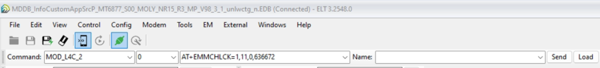
### 3.1 ELT Log

#### OTA Log
- **Ericsson's BBU**
  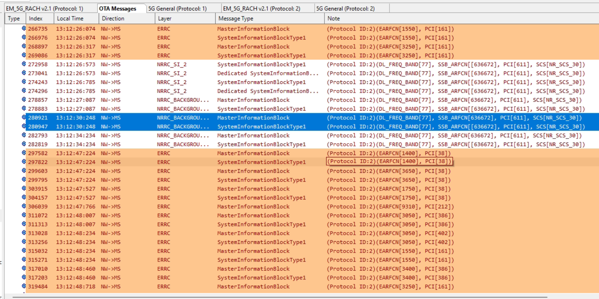
- **Nokia's BBU**
  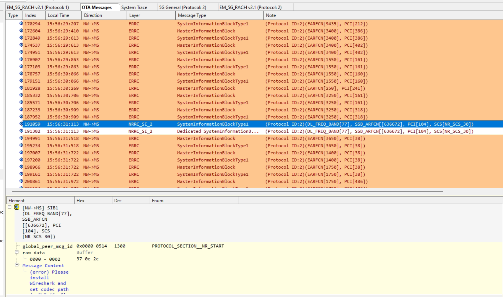

#### 5G General Log
- **Ericsson's BBU**
  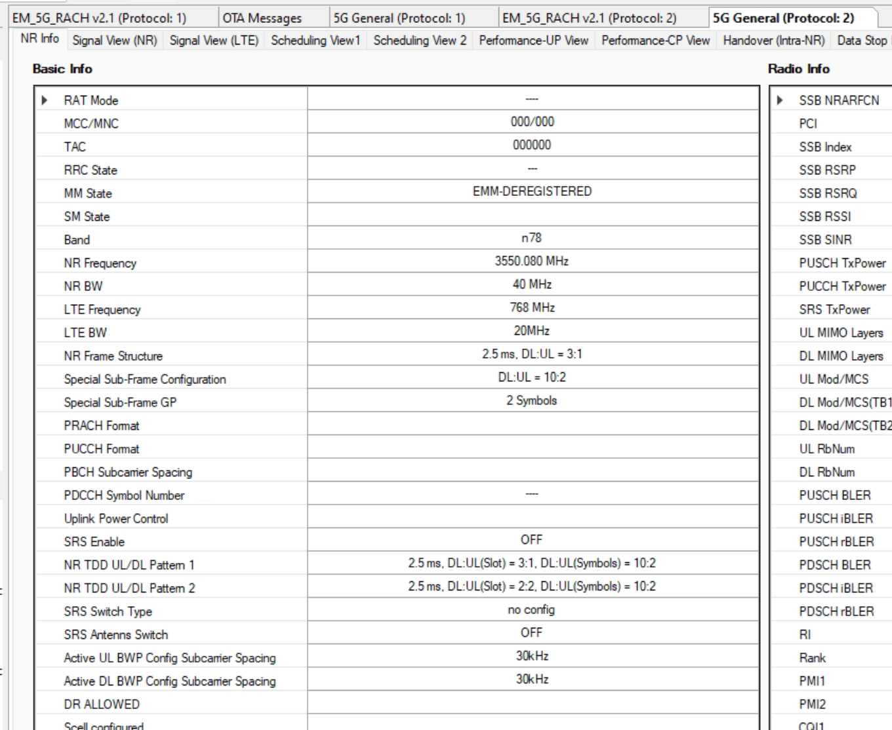
- **Nokia's BBU**
  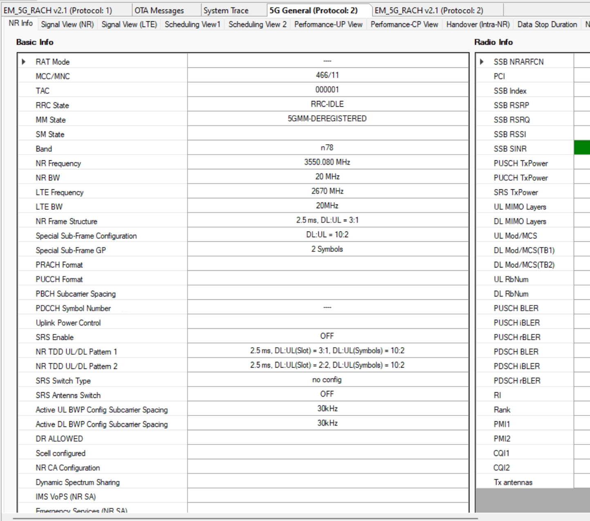

#### RACH Log
- **Ericsson's BBU**
  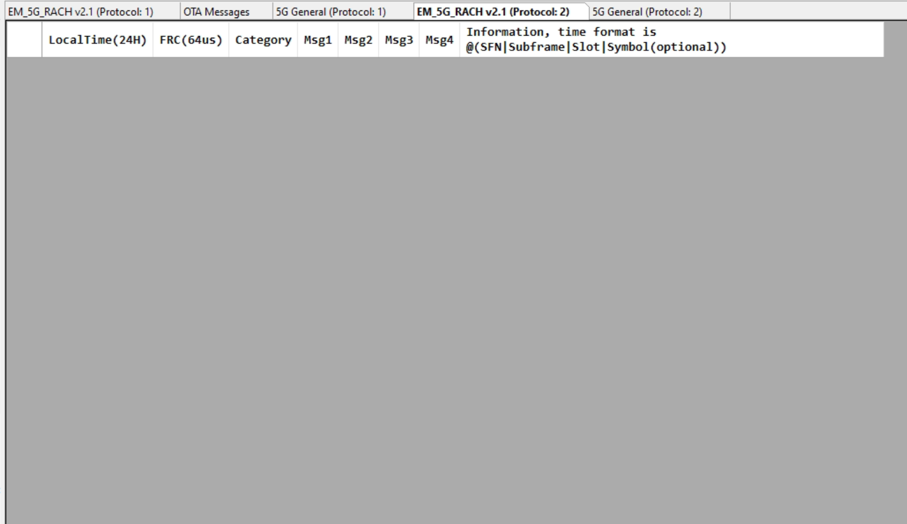
- **Nokia's BBU**
  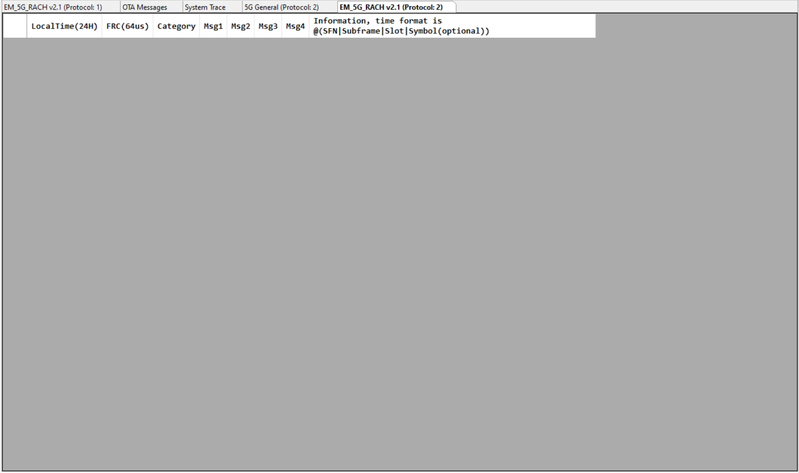

### 3.2 RACH Attacker 執行LOG

```bash
[UTIL]   running in SA mode (no --phy-test, --do-ra, --nsa option present)
[UTIL]   threadCreate() for Tpool0_-1: creating thread with affinity ffffffff, priority 97
[UTIL]   threadCreate() for Tpool1_-1: creating thread with affinity ffffffff, priority 97
[UTIL]   threadCreate() for Tpool2_-1: creating thread with affinity ffffffff, priority 97
[UTIL]   threadCreate() for Tpool3_-1: creating thread with affinity ffffffff, priority 97
[UTIL]   threadCreate() for Tpool4_-1: creating thread with affinity ffffffff, priority 97
[UTIL]   threadCreate() for Tpool5_-1: creating thread with affinity ffffffff, priority 97
[UTIL]   threadCreate() for Tpool6_-1: creating thread with affinity ffffffff, priority 97
[UTIL]   threadCreate() for Tpool7_-1: creating thread with affinity ffffffff, priority 97
[OPT]   OPT disabled
[HW]   Version: Branch: multi_preamble3 Abrev. Hash: d5790b82e7 Date: Mon Apr 28 18:06:18 2025 +0800
[NR_RRC]   create TASK_RRC_NRUE 
[UTIL]   threadCreate() for TASK_RRC_NRUE: creating thread with affinity ffffffff, priority 50
[UTIL]   threadCreate() for TASK_NAS_NRUE: creating thread with affinity ffffffff, priority 50
[SIM]   UICC simulation: IMSI=2089900007487, IMEISV=6754567890123413, Ki=fec86ba6eb707ed08905757b1bb44b8f, OPc=c42449363bbad02b66d16bc975d77cc1, DNN=oai, SST=0x01, SD=0xffffff
[NR_MAC]   [UE0] Initializing MAC
[NR_MAC]   Initializing dl and ul config_request. num_slots = 20
[RLC]   Activated srb0 for UE 0
[UTIL]   threadCreate() for time source realtime: creating thread with affinity ffffffff, priority 2
[UTIL]   time manager configuration: [time source: reatime] [mode: standalone] [server IP: 127.0.0.1} [server port: 7374] (server IP/port not used)
[PHY]   Set UE_fo_compensation 1, UE_scan_carrier 0, UE_no_timing_correction 0 
, chest-freq 0, chest-time 0
[PHY]   Set UE nb_rx_antenna 1, nb_tx_antenna 1, threequarter_fs 1, ssb_start_subcarrier 516
[PHY]   SA init parameters. DL freq 3550080000 UL offset 0 SSB numerology 1 N_RB_DL 106
[PHY]   Init: N_RB_DL 106, first_carrier_offset 900, nb_prefix_samples 108,nb_prefix_samples0 132, ofdm_symbol_size 1536
[PHY]   samples_per_subframe 46080/per second 46080000, wCP 43008
[UTIL]   threadCreate() for SYNC__actor: creating thread with affinity ffffffff, priority 97
[UTIL]   threadCreate() for DL__actor: creating thread with affinity ffffffff, priority 97
[UTIL]   threadCreate() for DL__actor: creating thread with affinity ffffffff, priority 97
[UTIL]   threadCreate() for DL__actor: creating thread with affinity ffffffff, priority 97
[UTIL]   threadCreate() for DL__actor: creating thread with affinity ffffffff, priority 97
[UTIL]   threadCreate() for UL__actor: creating thread with affinity ffffffff, priority 97
[UTIL]   threadCreate() for UL__actor: creating thread with affinity ffffffff, priority 97
[PHY]   Initializing UE vars for gNB TXant 1, UE RXant 1
[PHY]   prs_config configuration NOT found..!! Skipped configuring UE for the PRS reception
[PHY]   HW: Configuring card 0, sample_rate 46080000.000000, tx/rx num_channels 1/1, duplex_mode TDD
[PHY]   HW: Configuring channel 0 (rf_chain 0): setting tx_freq 3550080000 Hz, rx_freq 3550080000 Hz, tune_offset 0
[PHY]   HW: Configuring channel 0 (rf_chain 0): setting tx_gain 0, rx_gain 110
[PHY]   HW: Configuring card 1, sample_rate 46080000.000000, tx/rx num_channels 1/1, duplex_mode TDD
[PHY]   HW: Configuring channel 0 (rf_chain 0): setting tx_freq 3550080000 Hz, rx_freq 3550080000 Hz, tune_offset 0
[PHY]   HW: Configuring channel 0 (rf_chain 0): setting tx_gain 0, rx_gain 110
[PHY]   HW: Configuring card 2, sample_rate 46080000.000000, tx/rx num_channels 1/1, duplex_mode TDD
[PHY]   HW: Configuring channel 0 (rf_chain 0): setting tx_freq 3550080000 Hz, rx_freq 3550080000 Hz, tune_offset 0
[PHY]   HW: Configuring channel 0 (rf_chain 0): setting tx_gain 0, rx_gain 110
[PHY]   HW: Configuring card 3, sample_rate 46080000.000000, tx/rx num_channels 1/1, duplex_mode TDD
[PHY]   HW: Configuring channel 0 (rf_chain 0): setting tx_freq 3550080000 Hz, rx_freq 3550080000 Hz, tune_offset 0
[PHY]   HW: Configuring channel 0 (rf_chain 0): setting tx_gain 0, rx_gain 110
[PHY]   HW: Configuring card 4, sample_rate 46080000.000000, tx/rx num_channels 1/1, duplex_mode TDD
[PHY]   HW: Configuring channel 0 (rf_chain 0): setting tx_freq 3550080000 Hz, rx_freq 3550080000 Hz, tune_offset 0
[PHY]   HW: Configuring channel 0 (rf_chain 0): setting tx_gain 0, rx_gain 110
[PHY]   HW: Configuring card 5, sample_rate 46080000.000000, tx/rx num_channels 1/1, duplex_mode TDD
[PHY]   HW: Configuring channel 0 (rf_chain 0): setting tx_freq 3550080000 Hz, rx_freq 3550080000 Hz, tune_offset 0
[PHY]   HW: Configuring channel 0 (rf_chain 0): setting tx_gain 0, rx_gain 110
[PHY]   HW: Configuring card 6, sample_rate 46080000.000000, tx/rx num_channels 1/1, duplex_mode TDD
[PHY]   HW: Configuring channel 0 (rf_chain 0): setting tx_freq 3550080000 Hz, rx_freq 3550080000 Hz, tune_offset 0
[PHY]   HW: Configuring channel 0 (rf_chain 0): setting tx_gain 0, rx_gain 110
[PHY]   HW: Configuring card 7, sample_rate 46080000.000000, tx/rx num_channels 1/1, duplex_mode TDD
[PHY]   HW: Configuring channel 0 (rf_chain 0): setting tx_freq 3550080000 Hz, rx_freq 3550080000 Hz, tune_offset 0
[PHY]   HW: Configuring channel 0 (rf_chain 0): setting tx_gain 0, rx_gain 110
[PHY]   Intializing UE Threads for instance 0 ...
[UTIL]   threadCreate() for UEthread_0: creating thread with affinity ffffffff, priority 97
[UTIL]   threadCreate() for L1_UE_stats_0: creating thread with affinity ffffffff, priority 1
[HW]   openair0_cfg[0].sdr_addrs == 'type=b200'
[HW]   openair0_cfg[0].clock_source == '0' (internal = 0, external = 1)
[HW]   UHD version 4.6.0.HEAD-0-g50fa3baa (4.6.0)
[HW]   Checking for USRP with args type=b200
[HW]   Found USRP b200
[HW]   Setting clock source to internal
[HW]   Setting time source to internal
CMDLINE: "./nr-uesoftmodem" "-C" "3550080000" "-r" "106" "--numerology" "1" "--ssb" "516" "-E" "--band" "78" "-E" "--ue-fo-compensation" "--ue-txgain" "0" 
UE threads created by 132306
TYPE <CTRL-C> TO TERMINATE
[HW]   cal 0: freq 3500000000.000000, offset 44.000000, diff 50080000.000000
[HW]   cal 1: freq 2660000000.000000, offset 49.800000, diff 890080000.000000
[HW]   cal 2: freq 2300000000.000000, offset 51.000000, diff 1250080000.000000
[HW]   cal 3: freq 1880000000.000000, offset 53.000000, diff 1670080000.000000
[HW]   cal 4: freq 816000000.000000, offset 57.000000, diff 2734080000.000000
[HW]   RX Gain 0 110.000000 (44.000000) => 66.000000 (max 76.000000)
[HW]   USRP TX_GAIN:89.75 gain_range:89.75 tx_gain:0.00
[HW]   Actual master clock: 46.080000MHz...
[HW]   Actual clock source internal...
[HW]   Actual time source internal...
[HW]   setting rx channel 0
[HW]   RF board max packet size 1916, size for 100µs jitter 4608 
[HW]   rx_max_num_samps 1916
[HW]   RX Channel 0
[HW]     Actual RX sample rate: 46.080000MSps...
[HW]     Actual RX frequency: 3.550080GHz...
[HW]     Actual RX gain: 66.000000...
[HW]     Actual RX bandwidth: 40.000000M...
[HW]     Actual RX antenna: RX2...
[HW]   TX Channel 0
[HW]     Actual TX sample rate: 46.080000MSps...
[HW]     Actual TX frequency: 3.550080GHz...
[HW]     Actual TX gain: 89.750000...
[HW]     Actual TX bandwidth: 40.000000M...
[HW]     Actual TX antenna: TX/RX...
[HW]     Actual TX packet size: 1916
Entering ITTI signals handler
TYPE <CTRL-C> TO TERMINATE
Using Device: Single USRP:
  Device: B-Series Device
  Mboard 0: B210
  RX Channel: 0
    RX DSP: 0
    RX Dboard: A
    RX Subdev: FE-RX2
  RX Channel: 1
    RX DSP: 1
    RX Dboard: A
    RX Subdev: FE-RX1
  TX Channel: 0
    TX DSP: 0
    TX Dboard: A
    TX Subdev: FE-TX2
  TX Channel: 1
    TX DSP: 1
    TX Dboard: A
    TX Subdev: FE-TX1

[HW]   Device timestamp: 1.222831...
[HW]   [RRU] has loaded USRP B200 device.
[HW]   current pps at 2.000000, starting streaming at 3.000000
[PHY]   SSB position provided
[NR_PHY]   Starting sync detection
[PHY]   [UE thread Synch] Running Initial Synch 
[NR_PHY]   Starting cell search with center freq: 3550080000, bandwidth: 106. Scanning for 1 number of GSCN.
[NR_PHY]   Scanning GSCN: 0, with SSB offset: 516, SSB Freq: 0.000000
[PHY]   Initial sync: pbch decoded sucessfully, ssb index 0
[PHY]   pbch rx ok. rsrp:65 dB/RE, adjust_rxgain:-15 dB
[NR_PHY]   Cell Detected with GSCN: 0, SSB SC offset: 516, SSB Ref: 0.000000, PSS Corr peak: 113 dB, PSS Corr Average: 72
[PHY]   [UE0] In synch, rx_offset 393208 samples
[PHY]   [UE 0] Measured Carrier Frequency offset 2504 Hz
[PHY]   Initial sync successful, PCI: 104
[PHY]   HW: Configuring channel 0 (rf_chain 0): setting tx_freq 3550082504 Hz, rx_freq 3550082504 Hz, tune_offset 0
[PHY]   Got synch: hw_slot_offset 34, carrier off 2504 Hz, rxgain 66.000000 (DL 3550082504.000000 Hz, UL 3550082504.000000 Hz)
[PHY]   UE synchronized! decoded_frame_rx=108 UE->init_sync_frame=1 trashed_frames=14
[PHY]   Resynchronizing RX by 393208 samples
[HW]   received write reorder clear context
[NR_RRC]   SIB1 decoded
[NR_MAC]   TDD period index = 6, based on the sum of dl_UL_TransmissionPeriodicity from Pattern1 (2.500000 ms) and Pattern2 (2.500000 ms): Total = 5.000000 ms
[NR_MAC]   Set TDD configuration period to: 4 DL slots, 2 UL slots, 5 slots per period (NR_TDD_UL_DL_Pattern is 3 DL slots, 1 UL slots, 10 DL symbols, 2 UL symbols)
[NR_MAC]   Set TDD configuration period to: 7 DL slots, 5 UL slots, 5 slots per period (NR_TDD_UL_DL_Pattern is 2 DL slots, 2 UL slots, 10 DL symbols, 2 UL symbols)
[NR_MAC]   Configured 2 TDD patterns (total slots: pattern1 = 5, pattern2 = 5)
[PHY]   N_TA_offset changed from 0 to 600
[MAC]   Initialization of 4-Step CBRA procedure
[NR_MAC]   RA-ResponseWindow need to be configured to a value lower than or equal to 10 ms
[NR_MAC]   PRACH max_num_occasions 1 
[NR_MAC]   Selected PRACH occasion 0: slot 19, start symbol 0, fdm 0, association period 0
[NR_MAC]   PRACH scheduler: Selected RO Frame 128, Slot 19, Symbol 0, Fdm 0
[PHY]   Generate NR PRACH 128.19 	 NCS: 69 	 rootSequenceIndex : 0 
[PHY]   PRACH [UE 0] fd_occasion 0/0 in frame.slot 128.19, placing PRACH in position 2980, Msg1/MsgA-Preamble frequency start 49 (k1 49), preamble_offset 3, first_nonzero_root_idx 0
[PHY]   PRACH fd_occasion 0 initial k is :1490, dftlen will be calculated, preamble_shift =0
[NR_MAC]   PRACH scheduler: Selected RO Frame 129, Slot 19, Symbol 0, Fdm 0
[PHY]   Generate NR PRACH 129.19 	 NCS: 69 	 rootSequenceIndex : 0 
[PHY]   PRACH [UE 0] fd_occasion 0/0 in frame.slot 129.19, placing PRACH in position 2980, Msg1/MsgA-Preamble frequency start 49 (k1 49), preamble_offset 3, first_nonzero_root_idx 0
[PHY]   PRACH fd_occasion 0 initial k is :1490, dftlen will be calculated, preamble_shift =0
[NR_MAC]   PRACH scheduler: Selected RO Frame 130, Slot 19, Symbol 0, Fdm 0
[PHY]   Generate NR PRACH 130.19 	 NCS: 69 	 rootSequenceIndex : 0 
[PHY]   PRACH [UE 0] fd_occasion 0/0 in frame.slot 130.19, placing PRACH in position 2980, Msg1/MsgA-Preamble frequency start 49 (k1 49), preamble_offset 3, first_nonzero_root_idx 0
[PHY]   PRACH fd_occasion 0 initial k is :1490, dftlen will be calculated, preamble_shift =0
[NR_MAC]   PRACH scheduler: Selected RO Frame 131, Slot 19, Symbol 0, Fdm 0
[PHY]   Generate NR PRACH 131.19 	 NCS: 69 	 rootSequenceIndex : 0 
[PHY]   PRACH [UE 0] fd_occasion 0/0 in frame.slot 131.19, placing PRACH in position 2980, Msg1/MsgA-Preamble frequency start 49 (k1 49), preamble_offset 3, first_nonzero_root_idx 0
[PHY]   PRACH fd_occasion 0 initial k is :1490, dftlen will be calculated, preamble_shift =0
[NR_MAC]   PRACH scheduler: Selected RO Frame 132, Slot 19, Symbol 0, Fdm 0
[PHY]   Generate NR PRACH 132.19 	 NCS: 69 	 rootSequenceIndex : 0 
[PHY]   PRACH [UE 0] fd_occasion 0/0 in frame.slot 132.19, placing PRACH in position 2980, Msg1/MsgA-Preamble frequency start 49 (k1 49), preamble_offset 3, first_nonzero_root_idx 0
[PHY]   PRACH fd_occasion 0 initial k is :1490, dftlen will be calculated, preamble_shift =0
[NR_MAC]   PRACH scheduler: Selected RO Frame 133, Slot 19, Symbol 0, Fdm 0
[PHY]   Generate NR PRACH 133.19 	 NCS: 69 	 rootSequenceIndex : 0 
[PHY]   PRACH [UE 0] fd_occasion 0/0 in frame.slot 133.19, placing PRACH in position 2980, Msg1/MsgA-Preamble frequency start 49 (k1 49), preamble_offset 3, first_nonzero_root_idx 0
[PHY]   PRACH fd_occasion 0 initial k is :1490, dftlen will be calculated, preamble_shift =0
[NR_MAC]   PRACH scheduler: Selected RO Frame 134, Slot 19, Symbol 0, Fdm 0
[PHY]   Generate NR PRACH 134.19 	 NCS: 69 	 rootSequenceIndex : 0 
[PHY]   PRACH [UE 0] fd_occasion 0/0 in frame.slot 134.19, placing PRACH in position 2980, Msg1/MsgA-Preamble frequency start 49 (k1 49), preamble_offset 3, first_nonzero_root_idx 0
[PHY]   PRACH fd_occasion 0 initial k is :1490, dftlen will be calculated, preamble_shift =0
[NR_MAC]   PRACH scheduler: Selected RO Frame 135, Slot 19, Symbol 0, Fdm 0

...

```


---

## 4. 對照組測試

在實驗室重新測試相同的基站配置作為對照組。

結果顯示：**在解碼出 MIB 與 SIB1 後，UE 能夠正常接著完成 attach 的所有程序。**

### 4.1 對照組日誌截圖
- 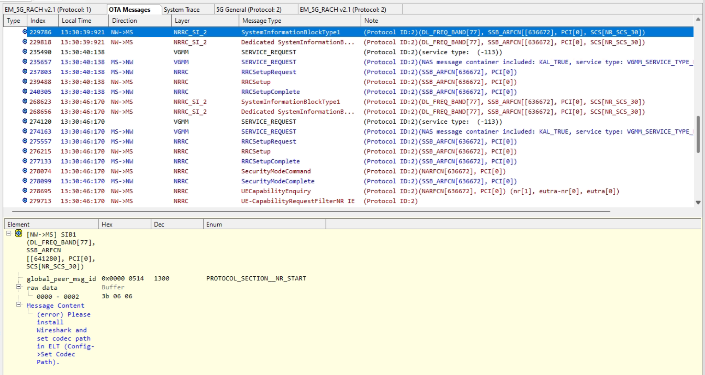
- 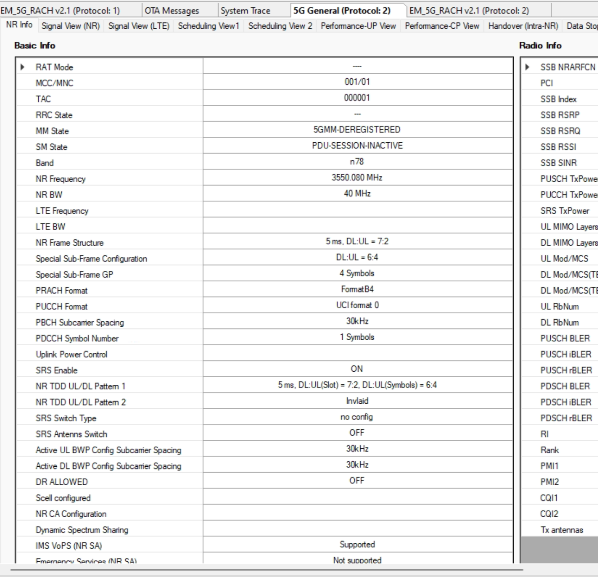
- 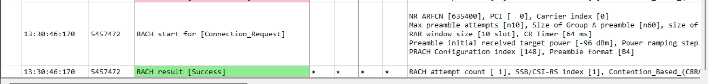

---

## 5. 測試結論與發現 (Conclusion & Findings)

### 5.1 結論
MTK UE 在鎖頻的情況下，**ELT OTA log 顯示已成功解碼出目標基站的 MIB 與 SIB1**，但**始終無法進入 Random Access (RACH) procedure**。

測試期間嘗試了多種故障排除方法，包含：
- 更換 SIM card
- 鎖定 PCI
- 關閉 Attacker
- 設備重新開機
- 調整設備位置

**結果：** 以上方法皆無法解決此問題。測試失敗

對比對照組的測試結果，UE 在相同的基站配置下能成功 attach，這表明此異常現象並非基站配置的問題。

### 5.2 資訊交流
- 與工程師確認後得知，目前 **Ericsson** 與 **Nokia** 兩家廠商的基站皆**沒有實作支援多 `msg1-FDM` (Multiple msg1-FDM) 的功能**。