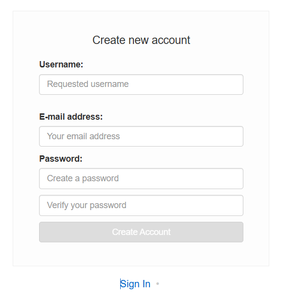

# O-Cloud

建立時間: 2025年12月3日 下午7:15
類別: o-clude
最後更新時間: 2026年5月18日 上午11:40

# **OAI gNB FHI72 容器映像檔建置與部署指南**

本文件說明如何建置 OpenAirInterface (OAI) gNB 容器映像檔，並推送至私有映像倉庫以供 O-Cloud 部署使用。

<aside>
💡

`ssh richard@192.168.8.53`

`curl -sS https://webinstall.dev/k9s | bash`

```bash
ssh user@192.168.8.77
user
enable
```

`bash -c "$(wget [https://raw.githubusercontent.com/ohmybash/oh-my-bash/master/tools/install.sh](https://raw.githubusercontent.com/ohmybash/oh-my-bash/master/tools/install.sh) -O -)"`

```bash
Last login: Wed May  6 12:32:05 on ttys014
yq@yqdeMacBook-Air ~ % ssh user@192.168.8.77

user@192.168.8.77's password: 
Last login: Sat May 16 14:49:13 2026 from 192.168.8.9
Welcome to Liteon ORU Mon May 18 03:22:18 UTC 2026
Please enter help
> enable
Enter Password: 
Auto exit privileged commands in 300 Seconds
# show 
arp            date           dl-ul-layer    eAXC-id        eth-info
evm-info       fw-info        oru-status     pm-data        ps
route          running-config sync-trace     system         uptime
# show 
arp            date           dl-ul-layer    eAXC-id        eth-info
evm-info       fw-info        oru-status     pm-data        ps
route          running-config sync-trace     system         uptime
# show 
arp            date           dl-ul-layer    eAXC-id        eth-info
evm-info       fw-info        oru-status     pm-data        ps
route          running-config sync-trace     system         uptime
# show running-config 
Band Width = 100000000
Center Frequency = 3619200000
Compression Bit = 9
Control and User Plane vlan = 6
M Plane vlan = 0
default gateway = 
dpd mode : Enable
DU MAC Address = 001122334466
phase compensation mode : Enable
RX attenuation = 14
TX attenuation = 24
subcarrier spacing = 1
rj45_vlan_ip = 10.101.131.61
SFP_vlan_ip = 10.101.131.62
SFP_non_vlan_static_ip = 192.168.1.100
prach eAxC-id port 0, 1, 2, 3 = 0x0000, 0x0001, 0x0002, 0x0003
slotid = 0x00000000
jumboframe = 0x00000001
sync source 
```

點燈一路發

</aside>

## **1. Building the shared images**

建置共用映像檔，包含：

- **ran-base**: 包含所有相依套件的基礎映像
- **ran-build-fhi72**: 編譯所有目標元件 (eNB, gNB, [nr]UE) 並支援 Fronthaul 7.2

### **1.1 Clone 原始碼並建置基礎映像**

Here I use richard repo for example (`msg1_fdm_enable`)

```bash
git clone https://github.com/Richard-yq/openairinterface5g.git
cd openairinterface5g
# default branch is develop, to change use git checkout <BRANCH>
podman build --target ran-base --tag ran-base:latest --file docker/Dockerfile.base.ubuntu22 .
# if you want to use front-haul 7.2 and RFSimulator radios
podman build --tag ran-build-fhi72:latest --file docker/Dockerfile.build.fhi72.ubuntu22 .
```

### **1.2 檢視已建置的映像檔**

```bash
podman image ls
```

## **2. 建置 gNB FHI72 映像檔**

使用 Dockerfile 建置支援 Fronthaul 7.2 的 gNB 映像：

```bash
podman build --tag oai-gnb-fhi72:latest --file docker/Dockerfile.gNB.fhi72.ubuntu22 .
```

## **3. 登入私有映像倉庫**

Register quay 

`bmw.ece.ntust.edu.tw`



登入 Harbor 映像倉庫以便後續推送映像：

```bash
podman login bmw.ece.ntust.edu.tw
```

- **登入資訊：**
    
    ```bash
    username: richardyq
    ```
    

## **4. 標記並推送映像至倉庫**

### **4.1 建置成功訊息**

### 4.2 為映像加上遠端倉庫標籤

將本地映像標記為遠端倉庫路徑：

```bash
podman tag localhost/oai-gnb-fhi72:latest bmw.ece.ntust.edu.tw/richardyq/oai-gnb-fhi72-fdm-enable:latest bmw.ece.ntust.edu.tw/richardyq/oai-gnb-fhi72-fdm-enable
```

### 4.3 推送映像至遠端倉庫

```bash
podman push bmw.ece.ntust.edu.tw/richardyq/oai-gnb-fhi72-fdm-enable:latest
```

- **`richardyq/oai-gnb-fhi72-fdm-enable`** - 映像檔的名稱，這是一個 OpenAirInterface (OAI) 的 5G 基站 (gNB) 映像檔，支援 FHI7.2 介面
- **`latest`** - 映像檔的標籤，表示最新版本

將本地建置好的 OAI gNB 容器映像檔上傳到 BMW 實驗室的私有伺服器，方便團隊成員共享和部署使用


## **5. 部署至 O-Cloud (使用 Helm)**

### **5.1 Clone Helm 模板**

git switch starlingx/pegatron Values.yaml -> repo & tag

```bash
<!-- git clone https://github.com/motangpuar/ocloud-helm-templates.git -->

git clone https://github.com/Richard-yq/ocloud-helm-templates.git

```

Revise config
`/home/richard/ocloud-helm-templates/oai-gnb-fhi-72/templates/configmap.yaml`

[ocloud-helm-templates/oai-gnb-fhi-72 at starlingx/liteon · Richard-yq/ocloud-helm-templates](https://github.com/Richard-yq/ocloud-helm-templates/tree/starlingx/liteon/oai-gnb-fhi-72)

```bash
helm install oai-richard -n richard --create-namespace  .
```

- **`helm install`** - Helm 的安裝指令，用於部署應用程式到 Kubernetes 叢集
- **`--create-namespace`** - 如果 `richard` 這個 namespace 不存在，自動建立它
- **`.`** - 表示使用當前目錄中的 Helm chart 進行安裝

這個指令會在 `richard` 命名空間中建立一個名為 `oai-richard` 的 Helm release，如果該命名空間不存在會自動建立

```bash
helm uninstall oai-richard -n richard
```

這個指令會刪除名為 `oai-richard` 的 Helm release 及其相關的所有 Kubernetes 資源（如 Pods、Services、Deployments 等）。

## Access k9s

```bash
ssh [richard@192.168.8.53](mailto:richard@192.168.8.53)
curl -sS [https://webinstall.dev/k9s](https://webinstall.dev/k9s) | bash
k9s
```


> 0 list all pods
> 


> `/`  to search pods
> 

> `l` to trace the log
> 

> `s` to enter the pods
> 

### LiteON RU


---

# CICD version
## Jenkis
https://jenkins.bmw.lab/

## Quay
https://bmw.ece.ntust.edu.tw/repository/

## Helm
https://github.com/Richard-yq/ocloud-helm-templates/tree/starlingx/liteon

## podman login and pull image

```bash
11:38:45 richard@newton ~ → podman login bmw.ece.ntust.edu.tw
Username: richardyq 
Password: 
Login Succeeded!
11:38:59 richard@newton ~ → podman pull bmw.ece.ntust.edu.tw/richardyq/oai-gnb:richard
Trying to pull bmw.ece.ntust.edu.tw/richardyq/oai-gnb:richard...
Getting image source signatures
Copying blob 5180f8af0361 done   | 
Copying blob 3a2ab645cf5d done   | 
Copying blob ce6187900b39 done   | 
Copying blob b5f5e0dfb71a done   | 
Copying blob 80372770b820 skipped: already exists  
Copying blob f9066905bed4 done   | 
Copying blob c44d0185eac0 done   | 
Copying blob 02a0207f7745 done   | 
Copying blob 15e399c6d2ec skipped: already exists  
Copying config ae45a39c9e done   | 
Writing manifest to image destination
ae45a39c9e5bc39bfe619bce6eeaea29d231a4bb86718a9ba46bd46d824786cd
11:39:12 richard@newton ~ → 
```

