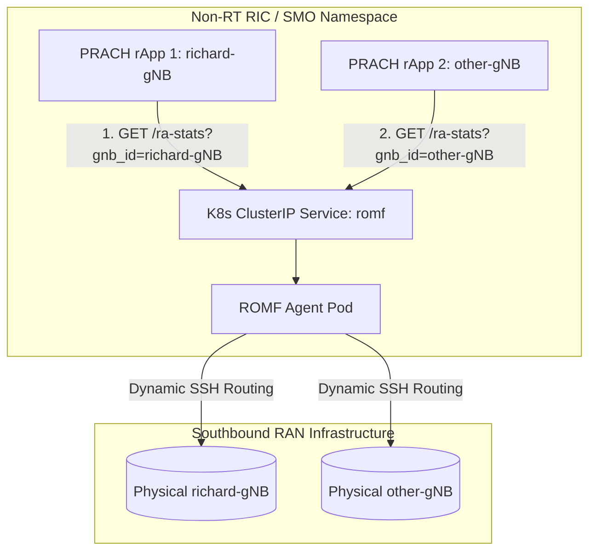
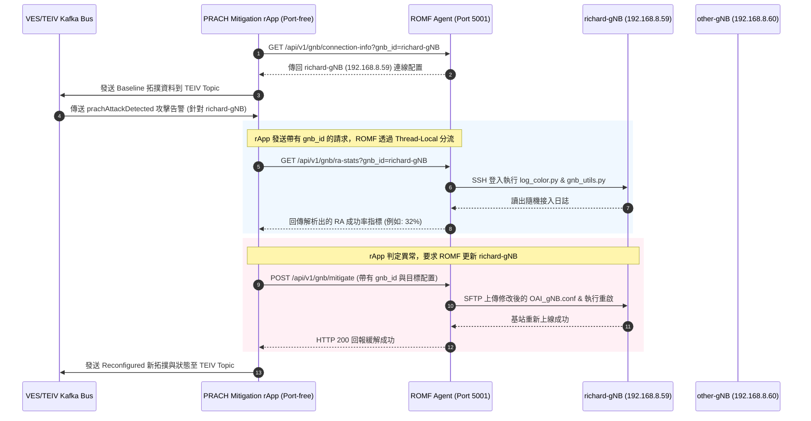

Viewed README.md:59-73

I will check how the rApp communicates the target config path and gNB information to ROMF by searching the exact endpoint calls inside the rApp's `main.py`.

Searched for "/api/v1/gnb/"

I will view the `main.py` implementation where connection information is queried and the active config is detected, specifically lines 170 to 223.

Viewed main.py:170-223

I will search for `gnb_ssh` or configuration loading in the ROMF agent code to check where it loads the target gNB connection details.

Searched for "gnb_ssh"

I will view the `monitor_config.json` inside the `romf` directory to see the exact structure of how the target gNB credentials and paths are isolated there.

Viewed monitor_config.json:1-12

在我們為你重構的「解耦多 Pod 架構（Decoupled Multi-Pod Architecture）」中，rApp 與 ROMF 之間的職責劃分非常清晰，實現了**安全隔離**與**極簡調用**。

以下是 **mitigation rApp 告訴 ROMF 要檢查哪台 gNB、讀取 Log 並重啟**的具體運作機制：

---

### 1. 設定與憑證的「完美隔離」（Encapsulation）
在舊架構中，rApp 需要自己知道 gNB 的 IP 和 SSH 帳密。但在新架構中：
* **gNB 的連線憑證**（包含 IP `192.168.8.59`、帳密 `oaignb/bmwlab`、預設配置文件路徑）都被**移出並封裝在 ROMF 自己的設定檔中**（本地為 `romf/monitor_config.json`，K8s 部署時為 `romf-config` 的 ConfigMap）。
* **rApp 完全不需要（也無法）知道 gNB 的 SSH 資訊**，rApp 唯一需要知道的只有 ROMF 的 REST API 服務網址（例如 K8s 內網的 `http://romf.nonrtric:5000`）。
* ROMF 就如同 gNB 的**代理人和狀態經紀人（State Broker）**，專門負責維護 SSH 通道。

---

### 2. rApp 如何叫 ROMF「檢查 Log」？
當 rApp 收到 Kafka 傳來的攻擊告警，需要分析 gNB 的隨機接入成功率（RA Success Rate）時：

```
[ rApp Pod ]                                        [ ROMF Pod ]                                 [ Physical gNB ]
     |                                                    |                                             |
     |--- 1. GET /api/v1/gnb/ra-stats ------------------->|                                             |
     |                                                    |--- 2. SSH (Paramiko 連線池) --------------->|
     |                                                    |      (在遠端執行 Log 解析指令)                |
     |                                                    |                                             |
     |                                                    |<-- 3. 回傳原始 Log 數據 ---------------------|
     |                                                    |      (進行微觀指標統計 & 成功率計算)          |
     |                                                    |                                             |
     |<-- 4. 回傳統計 JSON -------------------------------|                                             |
     |    { "success_rate": 0.6667, "total_preambles": 18 }|                                             |
```

1. **rApp 發送 REST 請求**：rApp 的 `main.py` 向 ROMF 的 `/api/v1/gnb/ra-stats` 發送 `GET` 請求（攜帶時間窗口參數）。
2. **ROMF 遠端登入**：ROMF 收到請求後，利用內部運作的 SSH 連線池（`ssh_loader.py`），使用設定檔中的帳密安全地 SSH 登入實體 gNB。
3. **南向解析**：ROMF 呼叫 `gnb_utils.py`，在遠端 gNB 上執行 Log 擷取指令，把 `$HOME/OAI_gNB.log` 的實時記錄抓回來，在 ROMF 內部用高效率的正則表達式解析 $N_{init}$、$N_{succ}$ 並計算成功率。
4. **極簡回傳**：ROMF 把解析完的高階指標打包成 JSON（如：`{"success_rate": 0.66, "total_preambles": 18}`）回傳給 rApp。rApp 輕鬆取得數據，完全不用經手 SSH 細節。

---

### 3. rApp 如何叫 ROMF「修改配置並重啟」？
當 rApp 判斷成功率過低，決定發動緩解措施（Mitigation）時：

```
[ rApp Pod ]                                        [ ROMF Pod ]                                 [ Physical gNB ]
     |                                                    |                                             |
     |--- 1. POST /api/v1/gnb/mitigate ------------------>|                                             |
     |      { "target_parameters": {"prach_...": 159},    |                                             |
     |        "config_path": "/home/.../OAI_gNB.conf" }   |                                             |
     |                                                    |--- 2. SFTP 下載當前配置文件 ----------------->|
     |                                                    |<-- 3. 下載完成 -----------------------------|
     |                                                    |      (ROMF 在本機安全修改參數，重新打包)       |
     |                                                    |                                             |
     |                                                    |--- 4. SFTP 上傳 _updated.conf ------------->|
     |                                                    |--- 5. SSH 重啟指令 (重啟 screen 裡的 gNB) ->|
     |                                                    |                                             |
     |<-- 6. 回傳成功狀態 { "config_updated": true } ------|                                             |
```

1. **rApp 發送更新指令**：rApp 調用 `apply_config_update()`，向 ROMF 的 `/api/v1/gnb/mitigate` 發送 `POST` 請求。
   * **Payload** 範例：
     ```json
     {
       "config_path": "/home/oaignb/richard-config/OAI_gNB.conf",
       "target_parameters": {
         "prach_ConfigurationIndex": 159
       }
     }
     ```
2. **ROMF 非破壞性修改配置**：
   * ROMF 收到 `POST` 後，透過 SFTP 下載 gNB 該路徑下的原始設定檔。
   * ROMF 呼叫 `gnb_config_updater.py` 本地修改參數，並將修改過後的檔案以 SFTP 上傳回 gNB，命名為非破壞性的 `OAI_gNB_updated.conf`（不破壞原本的基線）。
3. **ROMF 控制 gNB 重啟**：
   * ROMF 隨後發送 SSH 指令到 gNB，尋找並關閉原本在 `screen` 運行的 `nr-softmodem` 行程（`MONO_OAI_gNB`）。
   * 隨即用全新的 `OAI_gNB_updated.conf` 設定檔啟動新的 gNB 行程。
4. **rApp 獲知結果**：
   * 重啟完成後，ROMF 向 rApp 回傳 HTTP `200 OK` 及 `{ "status": "success", "config_updated": true }`。
   * rApp 知道緩解成功，隨後啟動 Kafka 將拓撲變更通知 TEIV（Topology Exposure and Inventory）。

---

### 💡 總結
mitigation rApp 是透過 **標準 HTTP REST 請求** 作為指令載體，來告訴 ROMF 執行何種操作。
* **rApp** 扮演 **「大腦（決策者）」**，只發送 REST 策略指令（"請幫我檢查 Log 指標"、"請幫我將參數改為 159 並重啟"）。
* **ROMF** 扮演 **「手腳（執行者）」**，擁有 gNB 的 SSH 鑰匙，負責登入 gNB 幹所有的髒活累活（SSH、SFTP、Regex 修改檔案、重啟 screen）。


---


# Implementation Plan - Multi-gNB & Multi-rApp Shared ROMF Gateway

This plan details the design and implementation steps to transform **ROMF (RAN OAM Mediation Function)** into a fully shared Southbound Mediation Gateway capable of serving **multiple rApps** controlling **multiple physical gNodeBs (gNBs)**. 

To achieve this elegantly without modifying the remote log parsing and config editing logic (`gnb_utils.py` and `gnb_config_updater.py`), we will introduce a **Request-scoped Thread-Local Routing** model in ROMF.

---

## 🏛️ Upgraded Multi-gNB Shared Architecture



### 1. Dynamic Routing Mechanism (Thread-Local Context)
* When a REST request arrives at ROMF, the `gnb_id` parameter (e.g. `richard-gNB` or `other-gNB`) is parsed from query parameters or JSON body.
* The `gnb_id` is bound to Python's request-scoped thread-local context.
* When the log parsing and utility functions invoke `ssh_gNB(cmd)`, the underlying SSH client loader dynamically fetches the connections cached for that specific `gnb_id`, routing the commands to the correct physical gNB.
* **Benefit**: Zero modifications are required in `gnb_utils.py` and `gnb_config_updater.py` which are already thoroughly tested!

---

## 🛠️ Step-by-Step Proposed Changes

### 1. Southbound Gateway (`romf`)

#### [MODIFY] [`monitor_config.json`](file:///Users/yq/Documents/develop/romf/monitor_config.json)
Transform `gnb_ssh` into a dictionary of active gNBs:
```json
{
  "gnbs": {
    "richard-gNB": {
      "host": "192.168.8.59",
      "user": "oaignb",
      "password": "bmwlab",
      "default_config_path": "/home/oaignb/richard-config/OAI_gNB.conf"
    },
    "other-gNB": {
      "host": "192.168.8.60",
      "user": "oaignb",
      "password": "bmwlab",
      "default_config_path": "/home/oaignb/other-config/OAI_gNB.conf"
    }
  },
  "romf": {
    "port": 5000
  }
}
```

#### [MODIFY] [`ssh_loader.py`](file:///Users/yq/Documents/develop/romf/ssh_loader.py)
* Add `_local_context = threading.local()` to keep track of active request `gnb_id`.
* Convert connection caches to `_ssh_runners = {}` keyed by `gnb_id`.
* Implement `set_active_gnb(gnb_id)` and `get_active_gnb()`.
* Update `_init_ssh_gnb()` to load connection parameters from `'gnbs'` based on the current active `gnb_id`.

#### [MODIFY] [`romf_agent.py`](file:///Users/yq/Documents/develop/romf/romf_agent.py)
* Implement a dynamic Flask `@app.before_request` hook:
  ```python
  @app.before_request
  def before_request():
      gnb_id = request.args.get('gnb_id')
      if not gnb_id and request.is_json:
          try: gnb_id = request.json.get('gnb_id')
          except: pass
      set_active_gnb(gnb_id or 'richard-gNB')
  ```
* Implement `get_gnb_config(gnb_id)` helper and replace all raw `config['gnb_ssh']` lookups to route connections cleanly.

---

### 2. Northbound Controller (`develop-richard-nonrtric-rapp-mitigation`)

#### [MODIFY] [`monitor_config.json`](file:///Users/yq/Documents/develop/develop-richard-nonrtric-rapp-mitigation/monitor_config.json)
* Add `"gnb_id": "richard-gNB"` to the rApp local configurations.

#### [MODIFY] [`main.py`](file:///Users/yq/Documents/develop/develop-richard-nonrtric-rapp-mitigation/main.py)
* Initialize `self.gnb_id = self.config.get('gnb_id', 'richard-gNB')` in constructor.
* In functions `get_gnb_connection_info`, `detect_config_from_log`, `analyze_ra_procedure_with_timeout`, and `get_current_config_params`, pass `gnb_id=self.gnb_id` as query parameters.
* In `apply_config_update`, include `"gnb_id": self.gnb_id` in the HTTP `POST` JSON payload.

---

## 🔍 Verification Plan

### 1. Compilation & Syntax Correctness
- Compile all updated Python files using `py_compile` to ensure 100% syntax cleanliness.

### 2. Multi-gNB Local Test
- Start `romf_agent.py` locally.
- Test routing by querying connection info for different gNB IDs:
  `curl http://localhost:5000/api/v1/gnb/connection-info?gnb_id=richard-gNB`
  `curl http://localhost:5000/api/v1/gnb/connection-info?gnb_id=other-gNB`
- Check that the returned SSH hosts correspond to the routed dictionary values.

---

Viewed romf_agent.py:313-313

在這次的架構解耦與多基站（Multi-gNB）動態路由重構完成後，**rApp** 與 **ROMF (RAN OAM Mediation Function) 服務**之間的整體運作流程已經轉變為符合 O-RAN 標準的雙 Pod 閉環控制架構。

以下是完整的系統運作流程說明：

---

### 🏛️ 系統架構分工
1. **ROMF Pod (基站運維編排協調服務)**:
   * 封裝了所有與基站直接互動的敏感資訊（SSH 帳密、SFTP 連線路徑）。
   * 運行一個輕量級 Flask Web 服務，並包含基於執行緒（Thread-Local）的動態路由機制。
2. **rApp Pod (衝突緩解微服務)**:
   * 僅負責控制邏輯（異常分析演算法、決策制定、發送 Kafka 拓撲更新）。
   * 不包含任何 SSH 邏輯，所有動作皆透過 HTTP REST API 向 ROMF 發起請求，並帶有特定的 `gnb_id`。

---

### 🔄 閉環控制與動態路由完整運作流程

#### 階段 1：系統初始化與基線拓撲建置
1. **rApp 啟動**：讀取 local 的 [monitor_config.json](file:///Users/yq/Documents/develop/develop-richard-nonrtric-rapp-mitigation/monitor_config.json)，讀出其目標基站識別碼 `"gnb_id": "richard-gNB"`。
2. **向 ROMF 查詢連線資訊**：
   * rApp 向 ROMF 發送 `GET /api/v1/gnb/connection-info?gnb_id=richard-gNB`。
   * **ROMF 動態路由**：`@app.before_request` 攔截器提取 `gnb_id`，設入該執行緒的 `threading.local`，`ssh_loader.py` 自動匹配 [monitor_config.json](file:///Users/yq/Documents/develop/romf/monitor_config.json) 中 `richard-gNB` 的配置，並將 SSH 連線主機（`192.168.8.59`）傳回給 rApp。
3. **TEIV 基線宣告**：rApp 取得配置後，將當前配置參數發送至 Kafka 的 `topology-inventory-ingestion` 主題，向 SMO 註冊 OAI-gNB 拓撲節點。

---

#### 階段 2：異常偵測與警報觸發 (Closed-Loop Trigger)
1. **攻擊發生**：基站遭受 PRACH Flooding 攻擊。
2. **Kafka 警報傳遞**：rApp 的 `VESAlarmMonitor` 持續監聽 Kafka 上的 VES Anomaly Alarms，當收到帶有 `prachAttackDetected` 特徵的告警時，閉環控制流程正式被觸發：
   ```python
   # main.py 中的觸發邏輯
   if 'prachAttackDetected' in event_name:
       self.detection_count += 1
       # 開始分析流程...
   ```

---

#### 階段 3：動態隨機接入（RA）指標收集與分析
1. **rApp 向 ROMF 要求分析數據**：
   * rApp 等待監控窗口後，向 ROMF 發送帶有基站標記的 REST 請求：
     `GET /api/v1/gnb/ra-stats?gnb_id=richard-gNB`
2. **ROMF 執行緒隔離與指令下發**：
   * ROMF 收到請求，將 `gnb_id = 'richard-gNB'` 綁定到當前 Request 執行緒。
   * `ssh_loader.py` 自動連線至 `192.168.8.59` (richard-gNB)。
   * 遠端執行 `cat $HOME/OAI_gNB.log`，透過 Regex 模組解析隨機接入成功率（RA Success Rate）。
   * 將解析結果（例如：`{"ra_initiated": 45, "ra_succeeded": 12, "success_rate": 26.6%}`）轉為 JSON 回傳給 rApp。

---

#### 階段 4：學術決策制定 (Decision Making)
rApp 根據 ROMF 回傳的數據，在本地使用 3GPP TS 38.321 標準指標進行分析決策：
* **條件 A**：隨機接入成功率是否低於閾值（例如 `< 70%`）？
* **條件 B**：絕對失敗次數是否超過閾值（`preambleTransMax`）？
* **決策輸出**：如果符合異常，將 `action_needed` 設為 `True`，並決定立即對該 gNB 實施緩解策略。

---

#### 階段 5：緩解動作執行與基站重啟 (Mitigation Phase)
1. **rApp 發送緩解指令**：
   rApp 向 ROMF 發送 POST 請求：`POST /api/v1/gnb/mitigate`
   * **JSON Payload**：
     ```json
     {
       "gnb_id": "richard-gNB",
       "config_path": "/home/oaignb/richard-config/OAI_gNB.conf",
       "target_parameters": {
         "prach_ConfigurationIndex": 98,
         "absoluteFrequencySSB": 621312,
         "dl_absoluteFrequencyPointA": 620040
       }
     }
     ```
2. **ROMF 隔離編輯與重啟**：
   * ROMF `@app.before_request` 將 `gnb_id` 定位至 `richard-gNB` 的 SSH 連線。
   * `GnbConfigUpdater` 下載遠端配置文件，就地修改 PRACH 指標參數，並上傳回基站。
   * 依序調用遠端控制腳本：
     1. `stop_session()`：關閉原 softmodem 進程。
     2. `force_stop_all_sessions()`：強制清理遺留資源。
     3. `start_softmodem_with_remote_conf(new_config)`：使用新配置重啟基站。
   * 將執行結果（是否變更成功、新配置文件路徑）回傳給 rApp。

---

#### 階段 6：拓撲同步更新 (Topology Synchronize)
rApp 收到 ROMF 的重啟成功回報後，再次透過內置的 `TEIVClient` 將新的 `GNB_SERVER_HOST`、`conf_file_path` 與調整後的隨機接入參數發佈至 Kafka，完成 SMO 側的拓撲資訊同步更新。

---

### 📊 運作流向圖 (Mermaid Diagram)



藉由這個全新流程，不論是 `richard-gNB` 或是未來新增的 `other-gNB`（甚至是其他開發者寫的 rApp），都可以共享同一個 ROMF 實例，各執行緒互不干涉、完全隔離，安全且高度可擴展。


---

