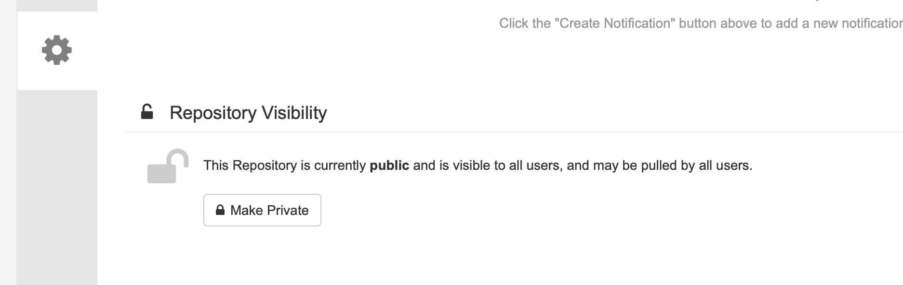
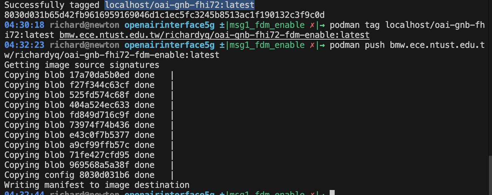

# OAI gNB FHI72 容器映像檔建置與部署指南

本文件說明如何建置 OpenAirInterface (OAI) gNB 容器映像檔，並推送至私有映像倉庫以供 O-Cloud 部署使用。

---

## 1. Building the shared images

建置共用映像檔，包含：
- **ran-base**: 包含所有相依套件的基礎映像
- **ran-build-fhi72**: 編譯所有目標元件 (eNB, gNB, [nr]UE) 並支援 Fronthaul 7.2

### 1.1 Clone 原始碼並建置基礎映像

```bash
git clone <repo>
cd openairinterface5g
# default branch is develop, to change use git checkout <BRANCH>
podman build --target ran-base --tag ran-base:latest --file docker/Dockerfile.base.ubuntu22 .
# if you want to use front-haul 7.2 and RFSimulator radios
podman build --tag ran-build-fhi72:latest --file docker/Dockerfile.build.fhi72.ubuntu22 .
```

### 1.2 檢視已建置的映像檔

```bash
docker image ls
```

---

## 2. 建置 gNB FHI72 映像檔

使用 Dockerfile 建置支援 Fronthaul 7.2 的 gNB 映像：

```bash
podman build --tag oai-gnb-fhi72:latest --file docker/Dockerfile.gNB.fhi72.ubuntu22 .
```

---

## 3. 登入私有映像倉庫

登入 Harbor 映像倉庫以便後續推送映像：

```bash
podman login bmw.ece.ntust.edu.tw
```

**登入資訊：**
```
username: richardyq
```

---

## 4. 標記並推送映像至倉庫

### 4.1 建置成功訊息

```
--> 8030d031b65d
Successfully tagged localhost/oai-gnb-fhi72:latest



### 4.2 為映像加上遠端倉庫標籤

將本地映像標記為遠端倉庫路徑：

```bash
podman tag localhost/oai-gnb-fhi72:latest bmw.ece.ntust.edu.tw/richardyq/oai-gnb-fhi72-fdm-enable:latest
```

### 4.3 推送映像至遠端倉庫

```bash
podman push bmw.ece.ntust.edu.tw/richardyq/oai-gnb-fhi72-fdm-enable:latest
```




```
Getting image source signatures
Copying blob 17a70da5b0ed done   | 
Copying blob f27f344c63cf done   | 
Copying blob 525fd574c68f done   | 
Copying blob 404a524ec633 done   | 
Copying blob fd849d716c9f done   | 
Copying blob 73974f74b436 done   | 
Copying blob e43c0f7b5377 done   | 
Copying blob a9cf99ffb57c done   | 
Copying blob 71fe427cfd95 done   | 
Copying blob 969568a5a38f done   | 
Copying config 8030d031b6 done   | 
Writing manifest to image destination
```

## 5. 部署至 O-Cloud (使用 Helm)

### 5.1 Clone Helm 模板
git switch starlingx/pegatron
Values.yaml -> repo & tag
```
<!-- git clone https://github.com/motangpuar/ocloud-helm-templates.git -->
git clone https://github.com/Richard-yq/ocloud-helm-templates.git

revise config
/home/richard/ocloud-helm-templates/oai-gnb-fhi-72/templates/configmap.yaml


```


```
helm install oai-richard -n richard --create-namespace  .
```

```
helm uninstall oai-richard -n richard
```


```
```


### Access liteon
```
ssh user@192.168.8.77
user
enable
liteon168
```

### access k9s
```
ssh richard@192.168.8.53
curl -sS https://webinstall.dev/k9s | bash
k9s

<!-- 
dog:command
0: all pod

/oai pods -->
```


<!-- 

```
04:32:44 richard@newton openairinterface5g ±|msg1_fdm_enable ✗|→ history
    1  2025-12-03 15:07:04 cd
    2  2025-12-03 15:07:04 ls
    3  2025-12-03 15:07:04 pwd
    4  2025-12-03 15:07:04 qwe
    5  2025-12-03 15:07:04 exit
    6  2025-12-03 15:07:04 exit
    7  2025-12-03 15:07:04 cd
    8  2025-12-03 15:07:04 bash -c "$(wget https://raw.githubusercontent.com/ohmybash/oh-my-bash/master/tools/install.sh -O -)"
    9  2025-12-03 15:07:04 ls
   10  2025-12-03 15:07:04 bash
   11  2025-12-03 15:07:29 git clone https://github.com/Richard-yq/openairinterface5g.git
   12  2025-12-03 15:07:59 cd openairinterface5g/
   13  2025-12-03 15:08:03 git log
   14  2025-12-03 15:08:24 git clone https://github.com/motangpuar/ocloud-helm-templates.git
   15  2025-12-03 15:09:29 podman build --target ran-base --tag ran-base:latest --file docker/Dockerfile.base.ubuntu22 .
   16  2025-12-03 15:34:34 podmen build --target ran-build --tag ran-build:latest --file docker/Dockerfile.build.ubuntu .
   17  2025-12-03 15:34:44 podmen build --target ran-build --tag ran-build:latest --file docker/Dockerfile.build.ubuntu22 .
   18  2025-12-03 15:34:59 podman build --target ran-build --tag ran-build:latest --file docker/Dockerfile.build.ubuntu22 .
   19  2025-12-03 15:47:16 podman build --tag ran-build-fhi72:latest --file docker/Dockerfile.build.fhi72.ubuntu22 .
   20  2025-12-03 16:16:54 docker build --target oai-gnb-fhi72 --tag oai-gnb-fhi72:latest --file docker/Dockerfile.gNB.fhi72.ubuntu  .
   21  2025-12-03 16:17:07 podman build --target oai-gnb-fhi72 --tag oai-gnb-fhi72:latest --file docker/Dockerfile.gNB.fhi72.ubuntu22  .
   22  2025-12-03 16:17:18 podman build --target oai-gnb-fhi72 --tag oai-gnb-fhi72:latest --file docker/Dockerfile.gNB.fhi72.ubuntu  .
   23  2025-12-03 16:17:52 podman build --target oai-gnb-fhi72 --tag localhost/ran-build-fhi72:latest --file docker/Dockerfile.gNB.fhi72.ubuntu22  .
   24  2025-12-03 16:19:06 podman images ls
   25  2025-12-03 16:21:14 vi docker/Dockerfile.gNB.fhi72.ubuntu22
   26  2025-12-03 16:21:58 podman image ls
   27  2025-12-03 16:22:38 podman tag localhost/ran-build-fhi72:latest ran-build-fhi72:latest
   28  2025-12-03 16:22:45 podman build --target oai-gnb-fhi72 --tag ran-build-fhi72:latest --file docker/Dockerfile.gNB.fhi72.ubuntu22  .
   29  2025-12-03 16:24:31 docker build --target oai-gnb-fhi72 --tag oai-gnb-fhi72:latest --file docker/Dockerfile.gNB.fhi72.ubuntu22  .
   30  2025-12-03 16:24:44 docker build --tag oai-gnb-fhi72:latest --file docker/Dockerfile.gNB.fhi72.ubuntu22  .
   31  2025-12-03 16:32:23 podman tag localhost/oai-gnb-fhi72:latest bmw.ece.ntust.edu.tw/richardyq/oai-gnb-fhi72-fdm-enable:latest  
   32  2025-12-03 16:32:37 podman push bmw.ece.ntust.edu.tw/richardyq/oai-gnb-fhi72-fdm-enable:latest

``` -->