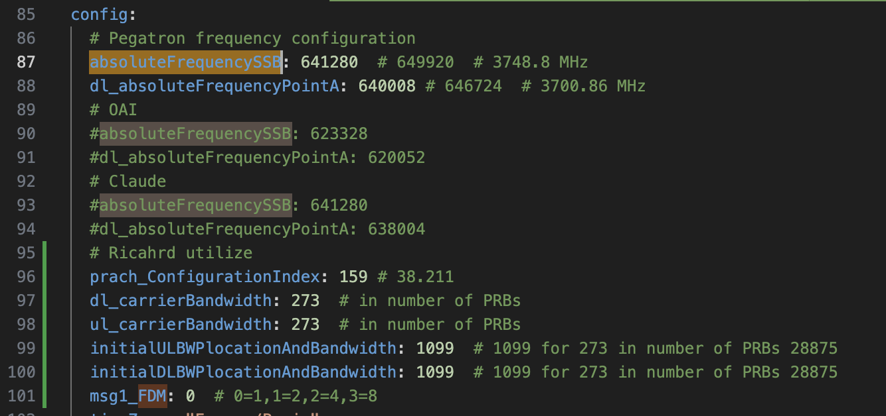

revise config
/home/richard/ocloud-helm-templates/oai-gnb-fhi-72/templates/configmap.yaml

ps: please modify original file even you change the file name

```
cd ocloud-helm-templates/oai-gnb-fhi-72
vim values.yaml
```



```
cd ocloud-helm-templates/oai-gnb-fhi-72
helm uninstall oai-richard -n richard
```

```
cd ocloud-helm-templates/oai-gnb-fhi-72
helm install oai-richard -n richard --create-namespace  .
```

